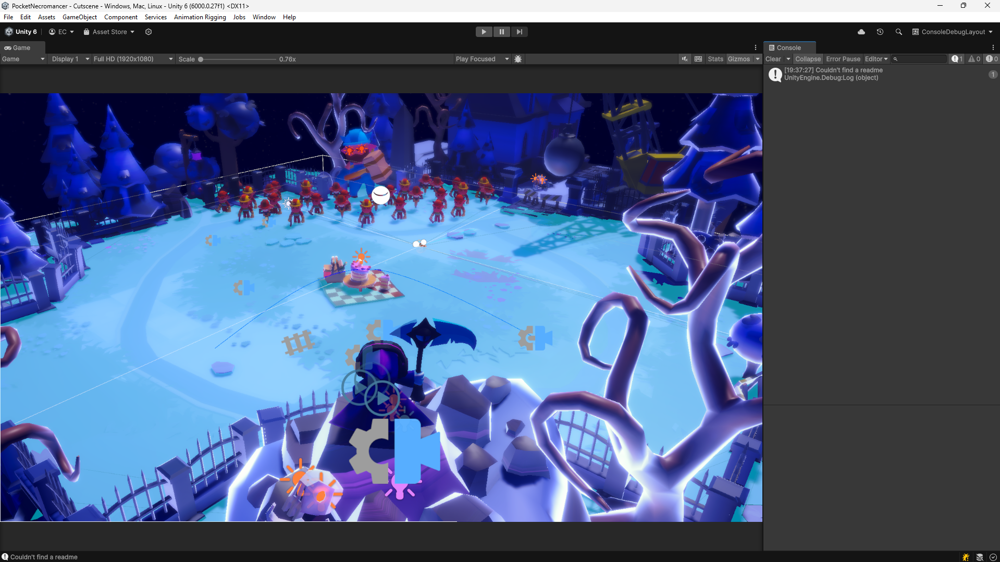

# UnityLayouts

## Introduction

This is my custom set of layouts that I use for my Unity projects on a daily basis. Each Layout will come with a brief explanation and a screenshot.

Enjoy!

## Layouts

### Console Debug Layout

- **Monitors**: 1
- **Purpose**: Play session debug: the user can watch the play session on detail - even record it - while keeping track of the signals launched from code