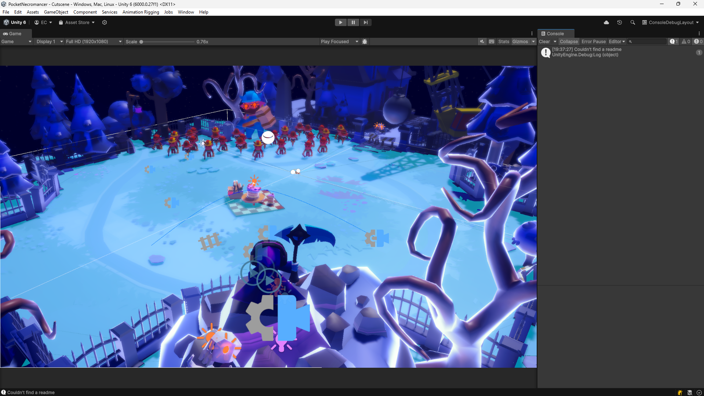
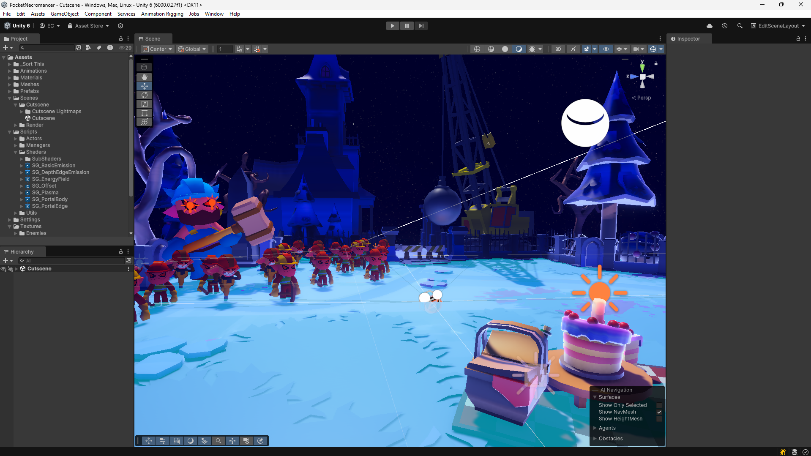
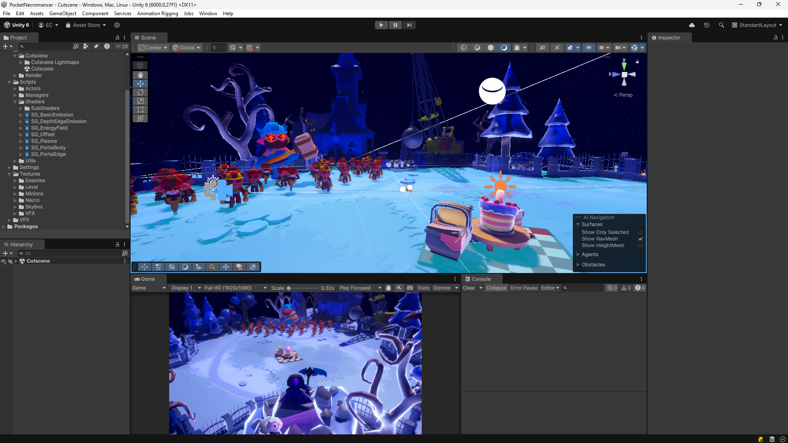
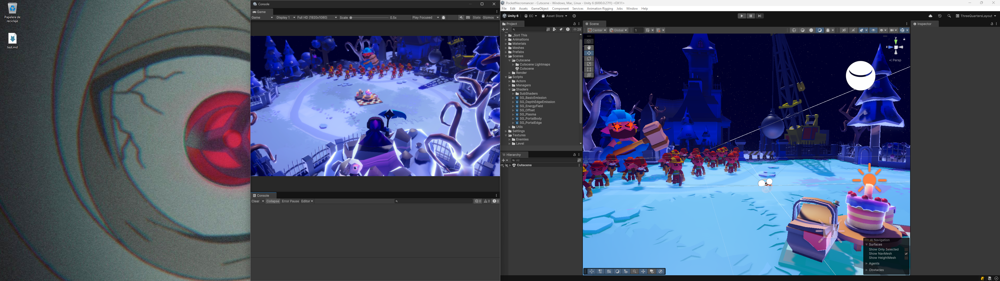
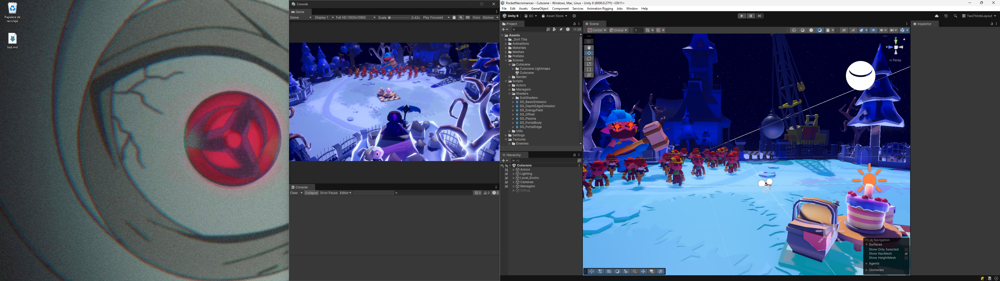
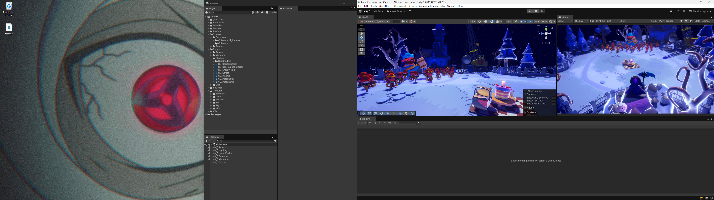
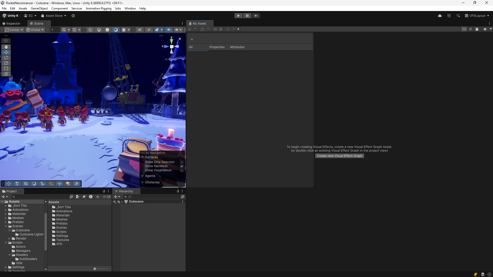
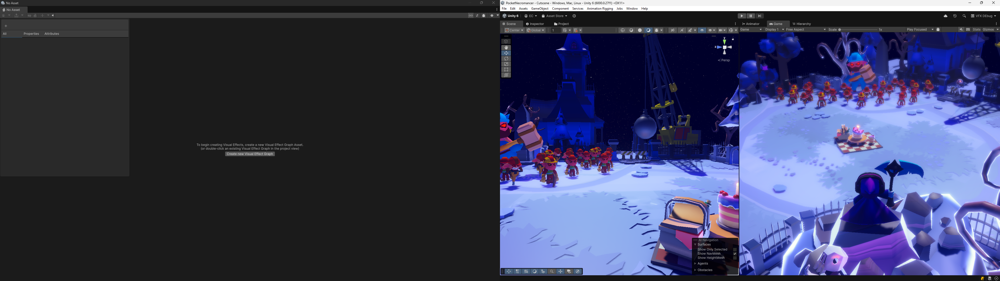

# UnityLayouts

## Introduction

This is my custom set of layouts that I use for my Unity projects on a daily basis. Each Layout will come with a brief explanation and a screenshot.

Enjoy!

## Layouts

### Console Debug Layout

- **Monitors**: 1
- **Purpose**: Play session debug: the user can watch the play session on detail - even record it - while keeping track of the signals launched from code

### Edit Scene Layout

- **Monitors**: 1
- **Purpose**: Perfect layout for editing the scene

### Standard Layout

- **Monitors**: 1
- **Purpose**: The basic layout: one-size-fits-all approach for single monitor users

### Three Quarters Layout

- **Monitors**: 2
- **Purpose**: The basic layout for dual monitor users. This showcases all basic Unity windows, while leaving screen space for another window (code editors, build, browser...)

### Two Thirds Layout

- **Monitors**: 2
- **Purpose**: Like the Three Quarters Layout but with extra screen space

### Timeline Layout

- **Monitors**: 2
- **Purpose**: Dual monitor layout for generating cinematics using timeline: allows for asset interaction as well as code modification.

### VFX Layout

- **Monitors**: 1
- **Purpose**: Single monitor setup for VFX/Shader asset generation

### VFX Dual Monitor Layout

- **Monitors**: 2
- **Purpose**: Dual monitor setup for VFX/Shader asset generation